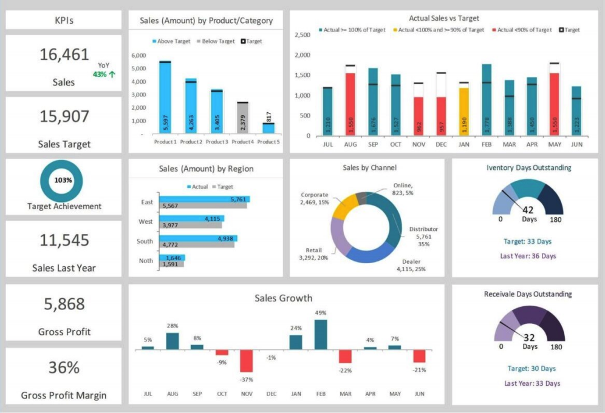
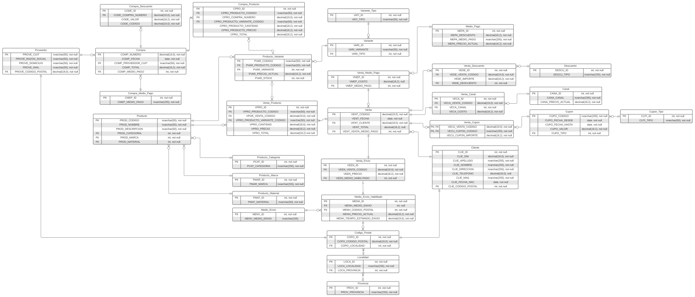
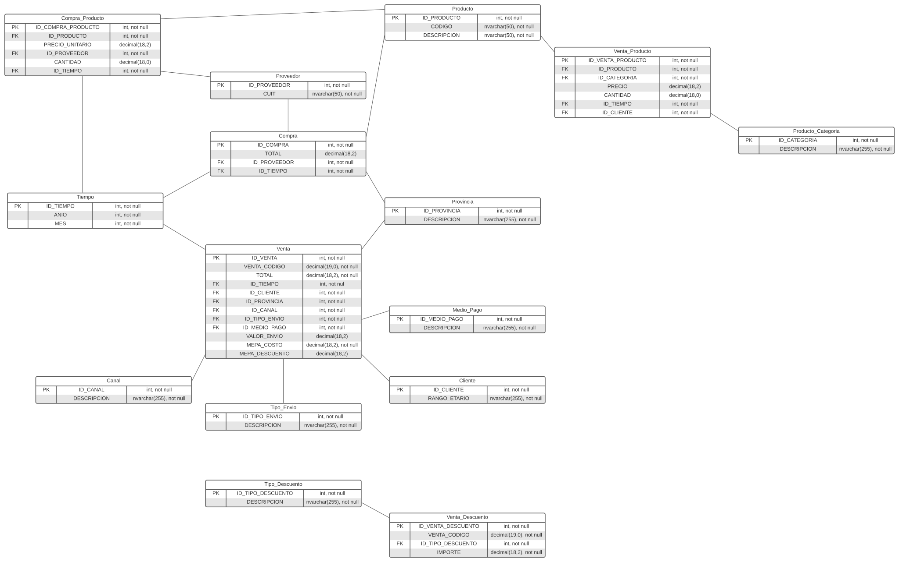

<h1 align="center"> Gestión Bazaar </h1>

 Trabajo Practico - Gestion de Datos - UTN FRBA 2022 2C  

# Objetivos del Trabajo Práctico

- Promover la investigación de técnicas de base de datos.
- Aplicar la teoría vista en la asignatura en una aplicación concreta.
- Desarrollar y probar distintos algoritmos sobre datos reales.
- Fomentar la delegación y el trabajo en grupo.

# Descripción general

Mediante este trabajo práctico se intenta simular la implementación de un nuevo
sistema. El mismo consiste en un software para la gestión de un negocio que vende
artículos de Bazar/Regalería tanto en local físico como a través de una plataforma
online.

La implementación de dicho sistema, requiere previamente realizar la migración de
los datos que se tenían registrados hasta el momento. Para ello es necesario que se
reformule el diseño de la base de datos actual y los procesos, de manera tal que cumplan
con los nuevos requerimientos.

Además, se solicita la implementación de un segundo modelo, con sus
correspondientes procedimientos y vistas, que pueda ser utilizado para la obtención de
indicadores de gestión, análisis de escenarios y proyección para la toma de decisiones.

> _Ver enunciado completo [acá](tp/documentos/Enunciado.pdf)_

# Pasos para ejecutar el TP

## Requisitos Previos

### Utilizar un Motor SQL Server local

Tener disponible el motor SQL Server.

Cargar la los datos ya registrados:

1. Descomprimir el archivo [gd_esquema.Maestra.Table.rar](tp/database/gd_esquema.Maestra.Table.rar)
2. Ejecutar el archivo [EjecutarScriptTablaMaestra.bat](tp/database/EjecutarScriptTablaMaestra.bat)

### Utilizar Docker

Tener disponible Docker.

1. Ejecutar el archivo [install.sh](install.sh)

## Ejecución de Scripts

Primer se debe crear el Modelo Operativo corriendo el script

    script_creacion_inicial.sql

Luego podemos crear el Modelo BI corriendo

    script_creacion_BI.sql

Ya podemos hacer consultas libremente sobre el modelo OLPT y el OLAP

### DER Modelo Datos

### DER Modelo BI

### LucidChart

Para la confección del DER, utilizamos la herramienta [LucidChart](https://www.lucidchart.com):

- [Modelo de Datos](https://lucid.app/lucidchart/4b07c250-a3f0-4099-98a6-95581a7dbb32/edit?invitationId=inv_05041888-b584-4db2-a2a2-e8211068b1a5&page=vlwS8_zE-Bex#)

- [Modelo de BI](https://lucid.app/lucidchart/0e57652c-dc0f-4291-9fa8-cec430f0e9a3/edit?viewport_loc=-11%2C-11%2C2219%2C900%2C0_0&invitationId=inv_5f74e0e2-5d07-41d7-9476-4dc547fe7d37)
